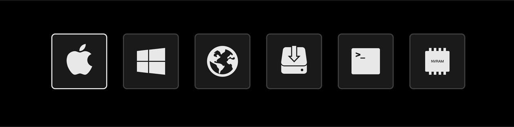

# OpenCanopy-Icons
OpenCore theme icons.

For details about how to use these then please consult the [OpenCore configuration documentation PDF](https://github.com/acidanthera/OpenCorePkg/blob/master/Docs/Configuration.pdf).

Btw. Or visit [OpenCanopy-Gallery](https://dortania.github.io/OpenCanopy-Gallery/).

## Preview
**Pure:**

    

**Jianfengzhi:**

    

**Jianfengzhi Source Preview:**

    

